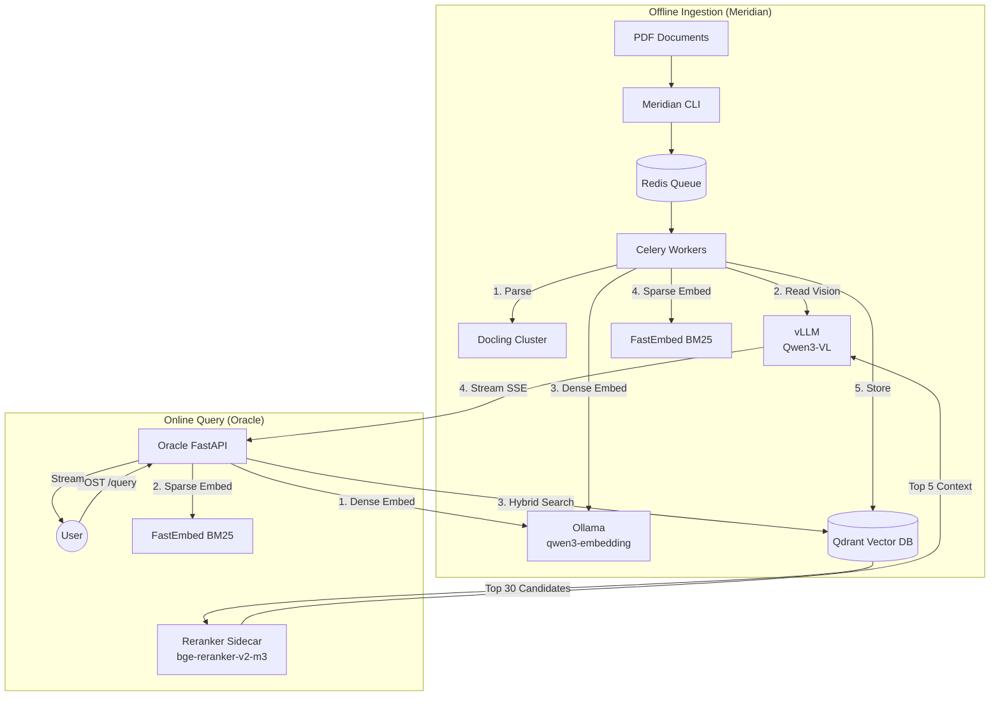

# Production RAG Ecosystem

A production-grade, end-to-end Retrieval-Augmented Generation (RAG) system engineered for high-throughput document processing and precision-critical query generation.

This repository is split into two primary subsystems:

1. **[Meridian](meridian/README.md)**: The offline, asynchronous document ingestion pipeline.
2. **[Oracle](oracle/README.md)**: The online, synchronous retrieval and generation pipeline.

---

## Architecture Overview

The system is designed around a shared infrastructure layer (Vector DB, LLM, Embeddings) allowing the ingestion and query pipelines to scale independently.



---

## The Subsystems

### 1. Meridian (Offline Ingestion)
[**➔ Read the Meridian Documentation**](meridian/README.md)

Meridian is a large-scale GPU-accelerated document processing pipeline. It extracts tables, figures, and formulas from PDFs, reads them with a vision-language model, and stores searchable dense and sparse (BM25) embeddings. 
- **Throughput**: Up to 118 pages/minute on a single H200.
- **Key Features**: Docling load balancing, Celery batch orchestration, VLM table/figure understanding, automatic instance failover.

### 2. Oracle (Online Query)
[**➔ Read the Oracle Documentation**](oracle/README.md)

Oracle is the synchronous query layer. It takes user questions, executes a Qdrant-native hybrid search (Dense HNSW + Sparse BM25 via RRF fusion), re-ranks the candidates using a cross-encoder, and streams a highly-constrained answer back to the user.
- **Key Features**: Hybrid search, BGE cross-encoder reranking, strict hallucination guardrails, mandatory inline citations, Server-Sent Events (SSE) streaming.

---

## Shared Infrastructure

Both systems rely on the following shared state and model services:
- **Qdrant (Port 6333)**: Vector database holding dense and sparse embeddings.
- **Ollama (Port 11434)**: Serves `qwen3-embedding:4b-q8_0` for dense vectorization.
- **vLLM (Port 8000)**: Serves `Qwen3-VL-8B-Instruct` for both Meridian's vision tasks and Oracle's strict text generation.
- **Redis (Port 6379)**: Acts as the Celery broker for Meridian.

## Quick Start

### 1. Clone & Setup
```bash
git clone https://github.com/Manushri19/Production-RAG.git
cd Production-RAG
```

### 2. Boot Infrastructure & Meridian
Start the shared databases and ingestion workers.
```bash
cd meridian
cp .env.example .env
make install
docker compose up -d
```

### 3. Ingest Documents
Process your PDFs to populate Qdrant with dense and sparse vectors.
```bash
meridian submit /path/to/your/pdfs --collection meridian_documents
```
*(Monitor progress with `meridian status`)*

### 4. Boot Oracle
Start the query API and the Reranker sidecar.
```bash
cd ../oracle
cp .env.example .env
docker compose up -d
```

### 5. Ask a Question
Stream an answer from Oracle based on your ingested documents.
```bash
curl -N -X POST http://localhost:8010/v1/query \
  -H "Content-Type: application/json" \
  -d '{"query": "What is the yield strength of the materials mentioned?"}'
```

---

## Hardware Requirements

- **GPU**: Strongly recommended (NVIDIA A100/H100/H200) for running vLLM and Docling concurrently at high throughput.
- **VRAM**: ~40GB minimum if running the full stack locally (Docling + vLLM + Ollama). Can be configured to run on smaller GPUs or CPU-only with performance tradeoffs.
- See the [Meridian Setup Notes](meridian/SETUP_NOTES.md) for detailed VRAM tuning matrices.

## License

Apache License 2.0. See [LICENSE](meridian/LICENSE) for details.
